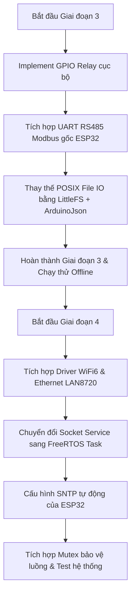

# Kế Hoạch Chi Tiết: Giai Đoạn 3 & 4 (Chuyển Đổi Nền Tảng LUCKFOX Linux -> ESP32-P4)

Kế hoạch này đi sâu vào chi tiết kỹ thuật cho hai giai đoạn phức tạp nhất: **Giai đoạn 3 (Quản lý Thiết bị - Device Control)** và **Giai đoạn 4 (Giao tiếp Mạng & Đồng bộ - Network & Sync)** khi chuyển đổi firmware KSmartZoneX từ Linux sang hệ sinh thái ESP32-P4 (Arduino / FreeRTOS).

---

## GIAI ĐOẠN 3: VIẾT LẠI BACKEND - QUẢN LÝ THIẾT BỊ (DEVICE CONTROL)

Mục tiêu chính là thay thế toàn bộ lớp HAL (Hardware Abstraction Layer) từ Linux (sysfs, termios) sang các driver phần cứng gốc của ESP32.

### 3.1. RS485 Driver & Modbus RTU
Trên Linux, việc giao tiếp RS485 sử dụng cổng nối tiếp `/dev/ttyS4` và thư viện cấu hình `termios`. Trên ESP32-P4, ta sẽ tận dụng bộ ngoại vi UART phần cứng có hỗ trợ sẵn chế độ RS485.

#### Cấu hình UART trên ESP32-P4:
*   **UART Peripheral:** Sử dụng `UART1` hoặc `UART2` (ESP32-P4 có 5 UARTs độc lập).
*   **RS485 Pins:** Cần xác định chính xác các chân TX, RX và chân điều khiển hướng (DE/RE - Driver Enable / Receiver Enable).
*   **Hardware Flow Control:** Tận dụng tính năng **RS485 Half-Duplex** của ESP32 để phần cứng tự động kéo chân DE/RE lên HIGH trước khi truyền và xuống LOW sau khi truyền xong byte cuối cùng. 
    ```cpp
    #include "driver/uart.h"
    // Cấu hình UART ở mức ESP-IDF để hỗ trợ Hardware RS485
    uart_config_t uart_config = {
        .baud_rate = RELAY_RS485_BAUD,
        .data_bits = UART_DATA_8_BITS,
        .parity = UART_PARITY_DISABLE,
        .stop_bits = UART_STOP_BITS_1,
        .flow_ctrl = UART_HW_FLOWCTRL_DISABLE,
        .rx_flow_ctrl_thresh = 122,
        .source_clk = UART_SCLK_DEFAULT,
    };
    uart_driver_install(UART_NUM_1, 2048, 2048, 0, NULL, 0);
    uart_param_config(UART_NUM_1, &uart_config);
    uart_set_pin(UART_NUM_1, TX_PIN, RX_PIN, RTS_PIN, UART_PIN_NO_CHANGE); // RTS_PIN làm chân DE/RE
    uart_set_mode(UART_NUM_1, UART_MODE_RS485_HALF_DUPLEX);
    ```

#### Dịch vụ Modbus & Quét Thiết bị (Discovery Service):
*   **Quét đồng bộ (`ks_relay_discovery_service_scan_sync`):** Gửi gói Modbus Read Coils (Function code `0x01`) đến từng Slave ID từ `1` đến `32`.
*   **Timeout & Retry:** Đặt timeout phản hồi là `80ms` (theo hằng số `RELAY_RS485_DISCOVERY_TIMEOUT_MS`). Sử dụng `millis()` để tính toán thời gian chờ phi block.
*   **Tính toán CRC16:** Giữ nguyên hàm tính toán CRC-16 Modbus hiện tại (hoặc sử dụng thuật toán bảng tra - lookup table để giảm thời gian xử lý CPU).

---

### 3.2. Local Relay Control (GPIO Cục bộ)
Mạch `ESP32-P4-86PANEL-ETH-2RO` tích hợp sẵn 2 Relay Output (RO1, RO2).
*   **Ánh xạ GPIO:** Cần cấu hình chân GPIO đầu ra điều khiển relay cục bộ.
*   **API thay thế:**
    *   `gpio_export()` và `gpio_out_direction()` trên Linux $\rightarrow$ `pinMode(RELAY_1_PIN, OUTPUT)` trên ESP32.
    *   `set_gpio(pin, val)` $\rightarrow$ `digitalWrite(RELAY_1_PIN, val)`.
    *   `read_gpio_state(pin, &val)` $\rightarrow$ `*val = digitalRead(RELAY_1_PIN)`.

---

### 3.3. File System (LittleFS & JSON Storage)
Trên Linux, cài đặt kênh relay và cấu hình hệ thống được lưu trữ dưới dạng file cấu hình JSON tại `RELAY_NAME_JSON_PATH`. Trên ESP32, ta sử dụng phân vùng bộ nhớ Flash thông qua thư viện `LittleFS` và thư viện `<ArduinoJson.h>` để parse dữ liệu.

#### Tiến trình khởi tạo & lưu trữ:
1.  **Mount LittleFS:** Khởi tạo bộ nhớ tệp tin ở hàm `custom_init()`:
    ```cpp
    #include "LittleFS.h"
    if(!LittleFS.begin(true)){
        Serial.println("LittleFS Mount Failed!");
    }
    ```
2.  **Đọc/Ghi File `relay_map.json`:**
    *   Sử dụng thư viện `ArduinoJson` (v6/v7) để đọc cấu trúc `devices` chứa tên hiển thị của các cổng relay.
    *   Thay thế các lệnh `fopen()`, `fprintf()` của Linux bằng đối tượng `File` của `LittleFS`.
    ```cpp
    #include <ArduinoJson.h>
    File file = LittleFS.open("/relay_map.json", "r");
    JsonDocument doc;
    deserializeJson(doc, file);
    file.close();
    ```

---

## GIAI ĐOẠN 4: GIAO TIẾP MẠNG & ĐỒNG BỘ DỮ LIỆU (NETWORK & SYNC)

Giai đoạn này xử lý kết nối Internet thông qua Wi-Fi 6 / Ethernet và duy trì kênh kết nối TCP socket thời gian thực với server KSmartZoneX.

### 4.1. Network Driver (WiFi6 + Ethernet)
Trên ESP32-P4, kết nối mạng được quản lý thông qua hai thư viện chuẩn: `<WiFi.h>` và `<ETH.h>`.

#### 1. Điều khiển Wi-Fi:
*   **Quét SSID (`wifi_scanning_ssid`):** Chuyển sang quét không đồng bộ (Asynchronous Scan) để tránh làm đơ giao diện LVGL (trước đó gây lỗi đóng băng màn hình).
    ```cpp
    // Bắt đầu quét phi block
    WiFi.scanNetworks(true); 
    
    // Polling trạng thái quét trong main loop hoặc timer
    int16_t scanResult = WiFi.scanComplete();
    if (scanResult >= 0) {
        // Có kết quả quét -> populate danh sách networks và cập nhật Dropdown
        network_count = scanResult > MAX_NETWORKS ? MAX_NETWORKS : scanResult;
        for (int i = 0; i < network_count; i++) {
            strncpy(networks[i].ssid, WiFi.SSID(i).c_str(), MAX_CONF_LEN);
            networks[i].signal_level = WiFi.RSSI(i);
        }
        WiFi.scanDelete(); // Giải phóng RAM
    }
    ```
*   **Kết nối Wi-Fi (`wifi_connect`):** Gọi `WiFi.begin(ssid, password)`. Trạng thái kết nối sẽ được quản lý bằng bộ check trạng thái tự động (`WiFi.status() == WL_CONNECTED`).

#### 2. Điều khiển Ethernet (ETH):
*   Bo mạch Waveshare/86PANEL sử dụng PHY Ethernet (thường là LAN8720/RMII). Khởi tạo ETH bằng:
    ```cpp
    ETH.begin(PHY_ADDR, PIN_POWER, PIN_MDC, PIN_MDIO, TYPE, CLK_MODE);
    ```
*   **Lớp Network Service:** Cập nhật hàm `read_eth_status()` để lấy trạng thái link và địa chỉ IP thực tế:
    ```cpp
    status->connected = ETH.linkUp();
    if(status->connected) {
        strncpy(status->ip, ETH.localIP().toString().c_str(), sizeof(status->ip));
    }
    ```

---

### 4.2. Socket Service (Raw TCP Client)
Linux sử dụng POSIX Socket, tạo một luồng thread nền qua `pthread_create` để duy trì kết nối TCP thô và gửi nhận JSON dòng (`\n` terminated).

#### Khả năng tương thích cực cao của ESP32 (LwIP):
> [!NOTE]
> Hệ điều hành FreeRTOS trên ESP32 (ESP-IDF) tích hợp sẵn ngăn xếp mạng **LwIP** hỗ trợ đầy đủ bộ thư viện **BSD Sockets** chuẩn (`<sys/socket.h>`, `<arpa/inet.h>`, `connect`, `recv`, `send`). Do đó, file `ks_socket_service.c` có thể được tái sử dụng gần như **90%** mà không cần viết lại bằng thư viện `WiFiClient` của Arduino.

#### Cấu trúc Socket Task trên FreeRTOS:
*   Thay thế `pthread_create` bằng API tạo Task của FreeRTOS:
    ```cpp
    xTaskCreatePinnedToCore(
        socket_worker_task,       /* Tên hàm task */
        "socket_worker",          /* Tên debug task */
        8192,                     /* Độ lớn Stack (8KB để xử lý chuỗi JSON lớn) */
        NULL,                     /* Tham số truyền vào */
        5,                        /* Ưu tiên Task */
        &g_socket_task_handle,    /* Task handle */
        1                         /* Ghim vào Core 1 (Core 0 chạy tác vụ hiển thị) */
    );
    ```
*   **Xử lý gói tin JSON:** Thay thế hàm trích xuất chuỗi JSON tự chế (`json_extract_string`) của Linux bằng bộ phân tích chuẩn `<ArduinoJson.h>` để tăng độ an toàn bộ nhớ (tránh buffer overflow).

---

### 4.3. NTP & Đồng bộ thời gian
Không cần thực hiện tạo socket UDP thủ công và gọi shell `date -s` như trên Linux. ESP32 tích hợp sẵn cơ chế SNTP trong nhân hệ thống.
*   **Khởi tạo NTP:**
    ```cpp
    #include "time.h"
    configTzTime(APP_TIMEZONE, NTP_SERVER_ADDRESS); // Cấu hình Timezone (ví dụ "ICT-7" cho Việt Nam) và máy chủ NTP
    ```
*   **Đọc thời gian:** Khi hệ thống có mạng, nhân LwIP sẽ tự động sync giờ trong nền. Hàm `ks_time_service_refresh_labels()` chỉ cần gọi `time(NULL)` và `localtime_r()` để hiển thị lên màn hình.

---

### 4.4. Đa luồng & An toàn bộ nhớ (Thread Safety)
Do giao diện LVGL chạy trên luồng chính (Main Thread / Arduino loop) còn Network/Socket Client xử lý trên một FreeRTOS Task khác, việc tranh chấp bộ nhớ (Race Condition) rất dễ xảy ra khi đồng thời thay đổi trạng thái Relay.

#### Thiết lập cơ chế bảo vệ:
1.  **Dùng FreeRTOS Mutex:** Tạo Mutex bảo vệ cache trạng thái relay `relay_states` và hàng đợi thay đổi giao diện.
    ```cpp
    SemaphoreHandle_t xRelayMutex = xSemaphoreCreateMutex();
    // Khi truy cập:
    if (xSemaphoreTake(xRelayMutex, portMAX_DELAY) == pdTRUE) {
        // Đọc hoặc ghi trạng thái cache
        xSemaphoreGive(xRelayMutex);
    }
    ```
2.  **Cập nhật giao diện an toàn (LVGL 9):** LVGL không an toàn với đa luồng (not thread-safe). Bất kỳ lệnh vẽ hoặc cập nhật widget nào từ Task Socket nền phải được đẩy qua hàng đợi (Dirty Bitmask) để luồng chính xử lý trong hàm `process_socket_ui_sync()` định kỳ `100ms`.

---

## 5. LỘ TRÌNH THỰC HIỆN CHI TIẾT (STEP-BY-STEP)



### Bước 1: Hiện thực hóa Driver Ngoại vi (Giai đoạn 3)
1.  Viết file `ks_gpio_service.cpp` map các hàm `set_gpio` trực tiếp vào chân GPIO thực tế của bo mạch.
2.  Chuyển đổi file `ks_relay_service.c` sang `cpp` để sử dụng `HardwareSerial` của Arduino hoặc cấu hình thanh ghi UART qua ESP-IDF APIs.
3.  Tạo tệp JSON mẫu và nạp vào phân vùng LittleFS qua công cụ *ESP32 Sketch Data Upload*.

### Bước 2: Tích hợp Kết nối mạng & Socket (Giai đoạn 4)
1.  Thay thế `ks_network_service.c` bằng bản code tích hợp `<WiFi.h>` và `<ETH.h>`, tập trung xử lý quét mạng Asynchronous.
2.  Tối ưu hóa `ks_socket_service.c` thành một FreeRTOS Task. Tận dụng tính năng BSD Sockets có sẵn trên ESP32 để giữ nguyên cấu trúc core socket.
3.  Kiểm tra độ ổn định kết nối khi mất mạng đột ngột (Auto-reconnect task).

---

> [!IMPORTANT]
> **Điểm cần lưu ý về LVGL 9:**
> Dự án đang sử dụng LVGL v9 (thay vì v8.3 trên Linux). Cần chú ý một số hàm API đã bị thay đổi (ví dụ: `lv_img_set_src` đổi tên thành `lv_image_set_src`). Chúng ta sẽ sử dụng bộ macro tương thích ở `ui_custom.h` để tránh làm hỏng các tệp UI gốc xuất ra từ SquareLine Studio.
